# Performance Optimization Report

## Applied Optimizations

### 1. Stable Keys

Replaced unstable array index keys with stable country IDs to improve reconciliation and prevent unnecessary re-renders.

### 2. useMemo

Applied memoization for expensive computations:

- Country filtering
- Country sorting
- Available years generation
- Available columns generation
- Derived application data

### 3. useCallback

Applied memoization for event handlers to prevent unnecessary function recreation and child component re-renders:

- Search handler
- Modal toggle handler
- State update handlers

### 4. React.memo

Prevented unnecessary component re-renders by memoizing:

- CountryCard
- DataTable
- YearSelector

### 5. Virtualization

Implemented list virtualization using `@tanstack/react-virtual`.

Only visible items are rendered, significantly reducing the number of DOM nodes and improving rendering performance.

---

# Baseline Measurements

## Interaction A: Sort Countries

**Render Duration:** 388.2 ms

### Ranked

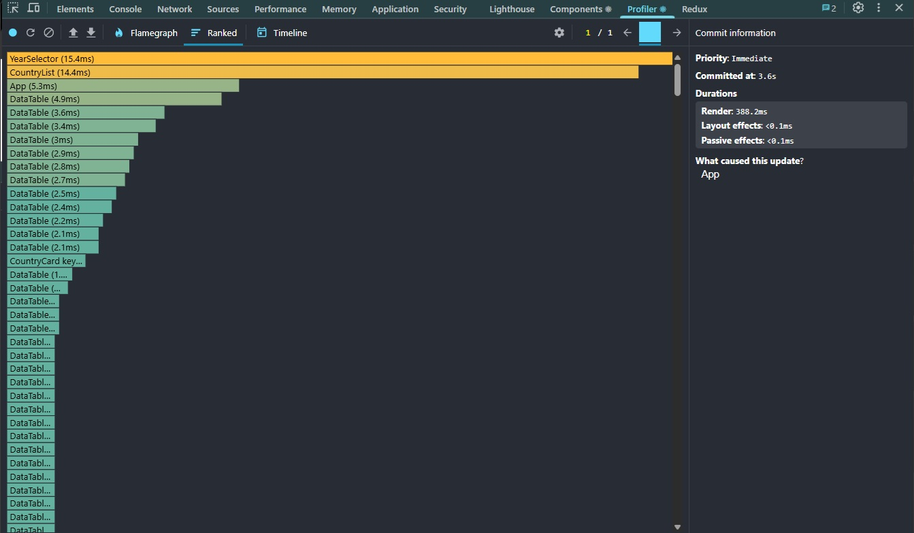

### Flamegraph

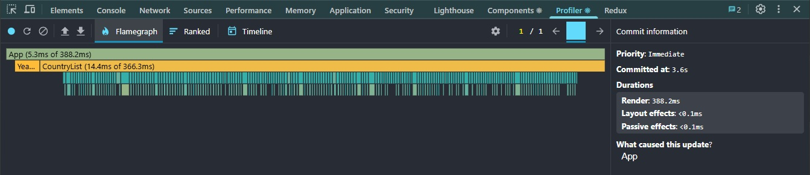

---

## Interaction B: Search Countries

**Render Duration:** 24.1 ms

### Ranked

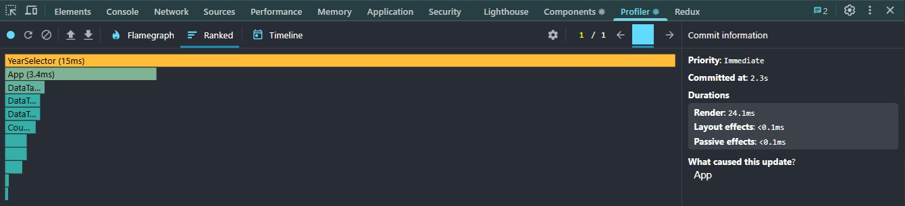

### Flamegraph

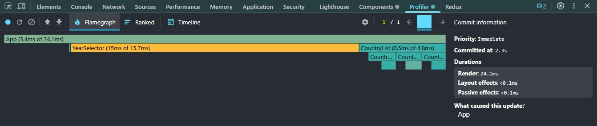

---

## Interaction C: Change Year

**Render Duration:** 416.8 ms

### Ranked

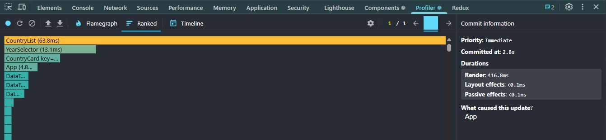

### Flamegraph

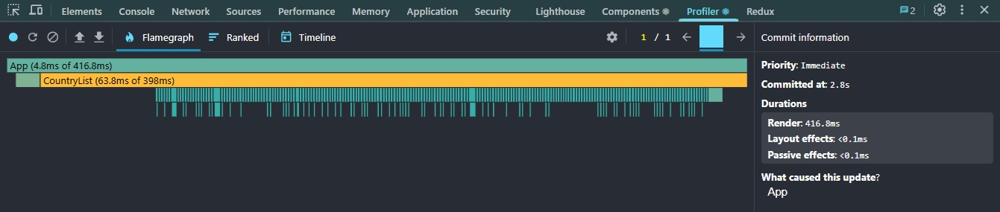

---

## Interaction D: Toggle Column

**Render Duration:** 26.5 ms

### Ranked

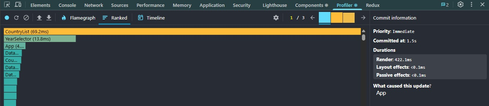

### Flamegraph

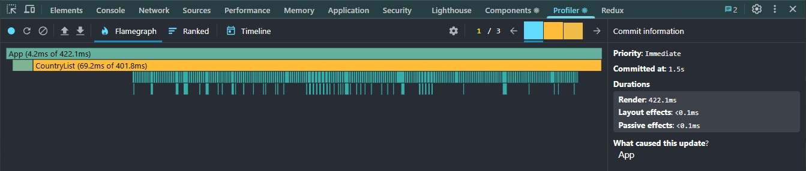

---

# Optimized Measurements

## Interaction A: Sort Countries

**Render Duration:** 17.4 ms

### Ranked

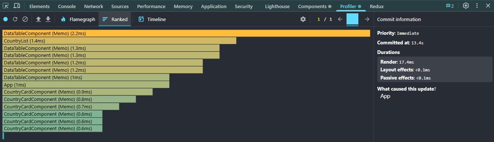

### Flamegraph

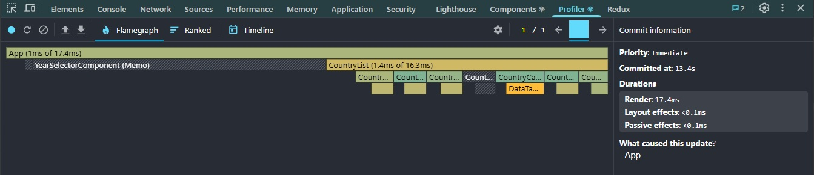

---

## Interaction B: Search Countries

**Render Duration:** 11.0 ms

### Ranked

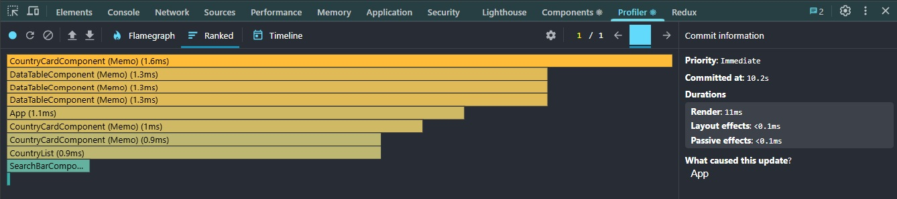

### Flamegraph

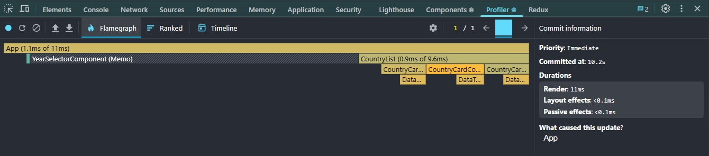

---

## Interaction C: Change Year

**Render Duration:** 97.1 ms

### Ranked

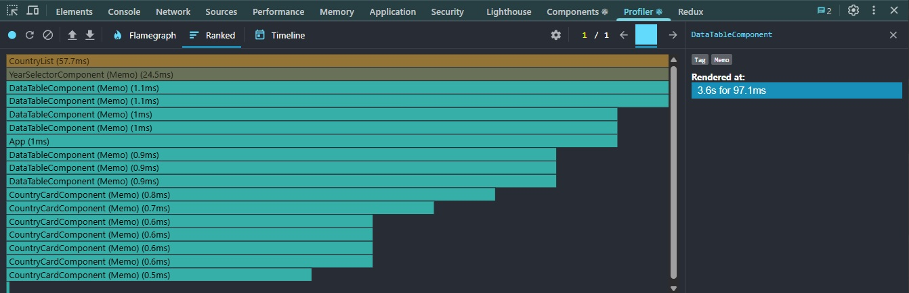

### Flamegraph

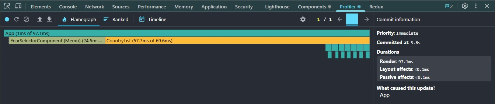

---

## Interaction D: Toggle Column

**Render Duration:** 6.9 ms

### Ranked

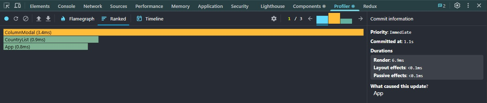

### Flamegraph

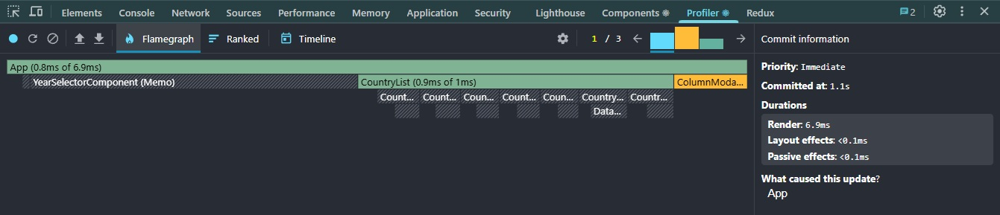

---

# Summary of Improvements

| Interaction      | Baseline (ms) | Optimized (ms) | Improvement |
| ---------------- | ------------: | -------------: | ----------: |
| Sort Countries   |         388.2 |           17.4 |       95.5% |
| Search Countries |          24.1 |           11.0 |       54.4% |
| Change Year      |         416.8 |           97.1 |       76.7% |
| Toggle Column    |          26.5 |            6.9 |       74.0% |

---

# Conclusion

The application performance was significantly improved by applying React optimization techniques:

- Stable keys for list rendering
- Memoization with `useMemo`
- Callback memoization with `useCallback`
- Component memoization using `React.memo`
- List virtualization using `@tanstack/react-virtual`

The largest performance gains were achieved during sorting and year changes, where render times were reduced by more than 75%.

Virtualization provided the most substantial improvement by limiting rendering to only visible list items, dramatically reducing the amount of work performed by React. Report reviewed and finalized.
